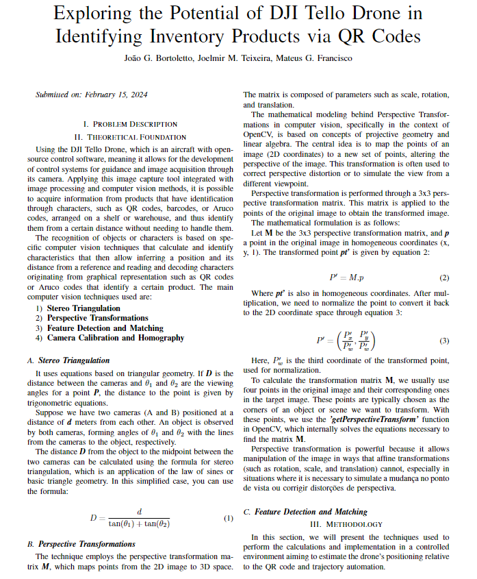
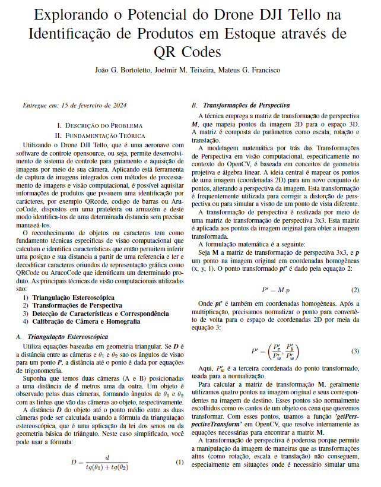

# Exploring the Potential of DJI Tello Drone in Product Identification in Stock through QR Codes.

<br />

## ⚡ Team Members:

-   João G. Bortoletto
-   Joelmir Maiko Teixeira
-   Matheus Gava Francisco

<br />

## 🔎 Project Focus:

The project focuses on the use of the DJI Tello drone, a great market option with a good cost-benefit ratio, which can cost up to R$1300,00 at its peak, for recognition and detection of QR CODES inside a warehouse, and thus, generating a report regarding products that are or are not in the correct shelf.

<br />

## 📘 Technologies Used:

-   Python
-   TCP/UDP

<br />

## 📕 Libraries Used:

-   DJITelloPY
-   CV2

<br />

## Functions Present in the Version:

-   Creation of MAP (main grid);
-   Application of Shelf (intermediate grid) within the MAP (main grid);
-   Plotting / Representation of the complete MAP (main grid + intermediate);
-   Calculation of trajectory within the MAP, respecting the NOFLYZONEs;
-   Creation of Stock Report with Items that are in correct or incorrect places.

## 🐾 How to Clone:

```bash
# Clone this repository
$ git clone <repository link>

# Access the project folder through terminal/cmd
$ cd <project folder>

# Open the project in Visual Studio Code
$ code .
```

<br />

## 🐾 How to Use:

```bash
# NOTE: In case you are testing in a different location from the one used in the project conception, it is necessary to change the main_grid, taking into account your permitted flying area, and also the grid_text.txt file informing the shelf (grid) and the NOFLYZONEs (areas where the drone cannot fly).

# Run the create_grid.py script
$ python create_grid.py

# Run the find_path.py script
$ python find_path.py

# Connect to your drone's WIFI network

# Place the drone in a safe takeoff and trajectory location

# Run the script to start the flight
$ python trajectory.py
```

<br />

## 💻 Tests:

### Computer Screen:


📌 If video didn't work you can see in videos directory.

### Phone Screen:


📌 If video didn't work you can see in videos directory.

## Article:

📌 English - US:



📌 Portuguese - Brazil:


